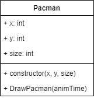
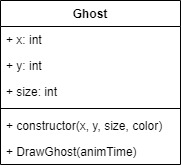
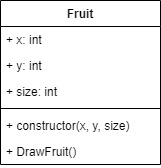
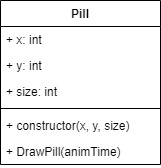
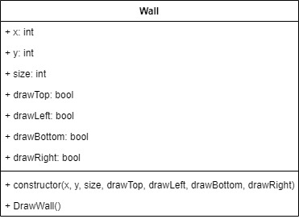
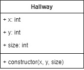
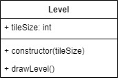

# gamedevelopment week 1

## opdracht

Maak met behulp van [https://www.draw.io/](https://www.draw.io/) klasse-diagrammen aan voor elk spelobject uit je lijst met spelobjecten. Plaats deze klasse-diagrammen op de juiste Wiki-pagina.

Hou er rekening mee dat elk object een Draw() functie moet krijgen (hierin ga je alle 'teken' code plaatsen), en dat elk object moet aangemaakt worden met een x-positie, een y-positie en een grootte.

## Klassen

### Pac-Man

### spook

### bolletje

### fruit

### pil

### muur

### gang

### speelveld

